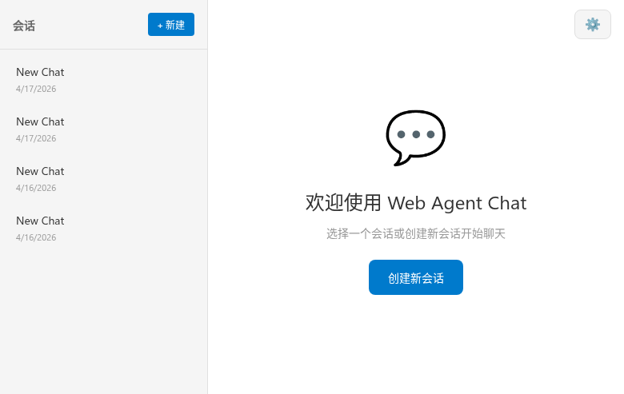
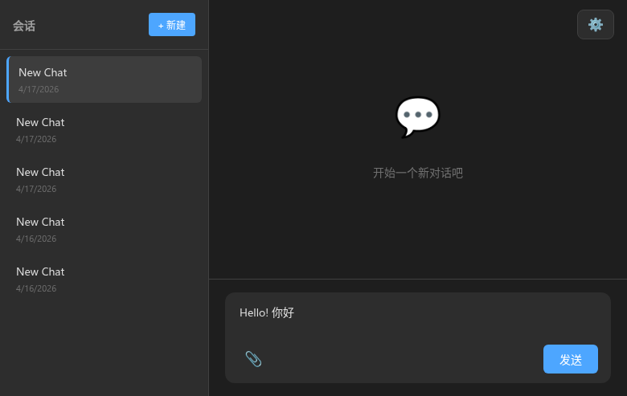
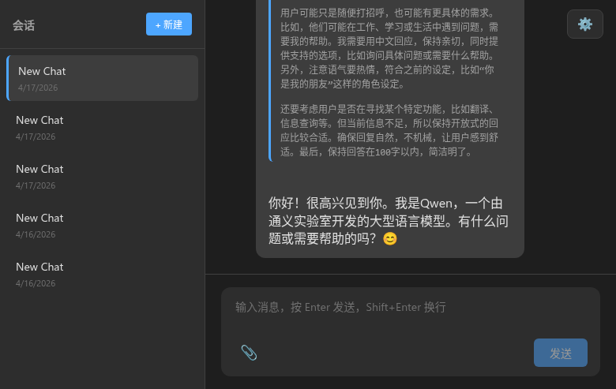
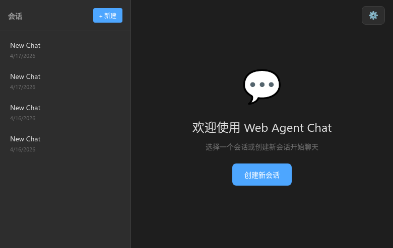
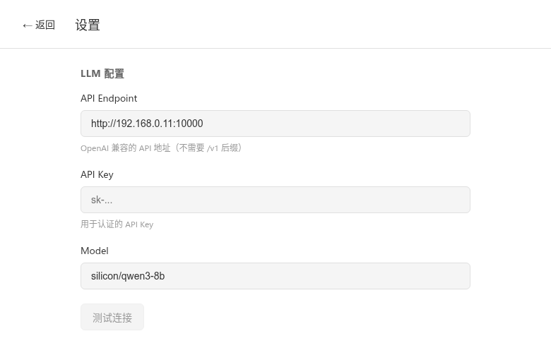
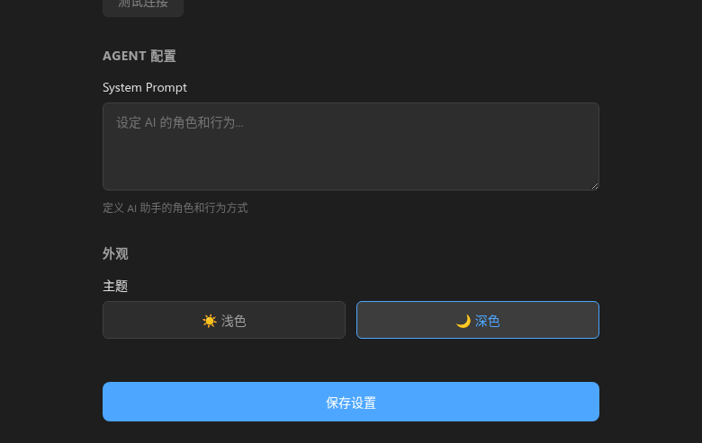

# Web Agent Chat System

基于 Vue + Express 的全栈 Web 应用，支持对接 OpenAI 兼容的大模型 API，提供 Web 聊天界面、会话管理、主题切换等功能。

## 快速启动

```bash
# 安装依赖
npm install

# 启动前后端开发服务器（同时运行 client 和 server）
npm run dev
```

启动后访问 `http://localhost:3000`（前端默认端口，实际端口可能因占用而变化）。

## 可用脚本

| 脚本 | 说明 |
|------|------|
| `npm run dev` | 启动前后端开发服务器 |
| `npm run dev:client` | 仅启动前端 |
| `npm run dev:server` | 仅启动后端 |
| `npm run build` | 构建前后端生产版本 |
| `npm run test` | 运行前后端测试 |
| `npm run lint` | 运行 ESLint 检查 |

## 项目结构

```
web-agent/
├── client/           # Vue 前端
│   ├── src/
│   │   ├── components/   # Vue 组件
│   │   ├── views/        # 页面视图
│   │   ├── stores/       # Pinia 状态管理
│   │   ├── api/          # API 封装
│   │   └── styles/       # 主题样式
├── server/           # Express 后端
│   └── src/
│       ├── routes/       # REST API 路由
│       ├── graphql/      # GraphQL 端点
│       └── services/     # 业务服务
├── data/             # SQLite 数据库
├── docs/             # 项目文档
└── package.json      # 根目录 workspace
```

## 文档说明

| 文件 | 说明 |
|------|------|
| [docs/1.constitution.md](docs/1.constitution.md) | 项目宪章：技术栈、代码规范、开发流程 |
| [docs/2.spec.md](docs/2.spec.md) | 需求规格说明书：功能需求、API 设计、数据模型 |
| [docs/3.plan.md](docs/3.plan.md) | 技术方案：目录结构、核心模块设计、风险评估 |
| [docs/4.tests.md](docs/4.tests.md) | 测试用例：功能测试场景 |
| [docs/5.tasks.md](docs/5.tasks.md) | 任务列表：开发任务追踪 |

## 主要功能

### 聊天界面（浅色主题）


### 对话界面


### 流式响应


### 聊天界面（暗色主题）


### 设置页面


### 设置页面（暗色主题）


- **聊天功能**：多轮对话、会话管理、流式响应
- **LLM 对接**：支持 OpenAI 兼容 API，自定义 Endpoint 和 API Key
- **Agent 配置**：可设置 System Prompt
- **数据管理**：会话导出/导入为 JSON
- **主题切换**：支持亮色/暗色主题

## 前端路由

| 路径 | 页面 |
|------|------|
| `/` | 聊天主界面 |
| `/settings` | 设置页面 |

## 前端 API

前端通过 `/api` 调用后端 REST API：

| 函数 | 说明 |
|------|------|
| `getSessions()` | 获取所有会话列表 |
| `createSession(title)` | 创建新会话 |
| `getSession(id)` | 获取会话详情（含消息） |
| `deleteSession(id)` | 删除会话 |
| `sendMessage(sessionId, content)` | 发送消息（非流式） |
| `sendMessageStream(sessionId, content, onChunk)` | 发送消息（流式） |
| `getSettings()` | 获取设置 |
| `updateSettings(settings)` | 更新设置 |
| `exportSession(id)` | 导出会话为 JSON |
| `importSession(json)` | 导入会话 |

## 后端 API

### REST API

| 方法 | 路径 | 描述 |
|------|------|------|
| GET | `/api/sessions` | 获取所有会话列表 |
| POST | `/api/sessions` | 创建新会话 |
| GET | `/api/sessions/:id` | 获取会话详情（含消息） |
| DELETE | `/api/sessions/:id` | 删除会话 |
| POST | `/api/chat` | 发送消息（非流式） |
| POST | `/api/chat/stream` | 发送消息（流式，SSE） |
| GET | `/api/sessions/:id/export` | 导出会话 |
| POST | `/api/sessions/import` | 导入会话 |
| GET | `/api/settings` | 获取设置 |
| PUT | `/api/settings` | 保存设置 |

### GraphQL

| 端点 | 说明 |
|------|------|
| POST `/graphql` | GraphQL API 端点 |
